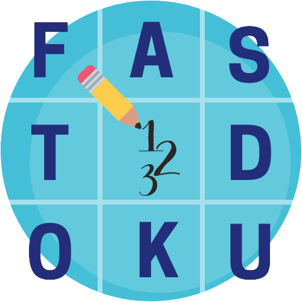

# FASTDOKU
**FASTDOKU** is a web application very simple and intuitive that allows friends or random strangers to challenge each other with sudoku puzzles in real-time.

FASTDOKU is a composition of two words: faster and sudoku. This is to emphasize that that the faster player wins the match and earns points.

#Structure
The application is composed essenctially by two module: one written in java and the other one written in erlang.